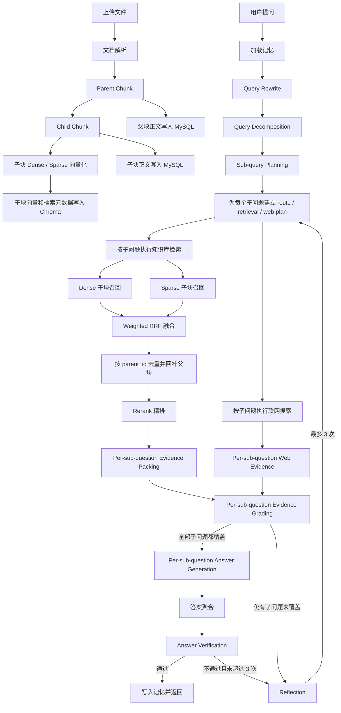

# Agentic RAG 实现说明

## 1. 文档目的

这份文档用于说明当前项目 `backend/` 目录下 Agentic RAG 的最新实现方式。  
本文只描述当前生效的新架构，不再保留旧的 Milvus 版本或旧数据兼容逻辑。

当前实现的目标是：

- 文档入库时只把子块向量和检索元数据写入 Chroma
- 父块和子块正文统一写入 MySQL
- 用户提问后先做意图识别、查询分解，并为每个子问题建立独立执行计划
- 检索阶段按子问题分别走 Dense + Sparse 双路召回、Weighted RRF 融合、父块回补、Rerank 精排
- 再按子问题做证据判断、反思循环、联网补充、答案生成，最后统一汇总并做事实校验

---

## 2. 当前总体架构

### 2.1 技术组件

- Web 框架：`FastAPI`
- Agent 编排：`LangGraph`
- 大模型：`DeepSeek V4`（通过 `langchain-deepseek` 的 `ChatDeepSeek` 接入；高频结构化任务使用 `deepseek-v4-flash`，生成、反思和持久记忆决策使用 `deepseek-v4-pro`）
- Embedding：`BGE-M3`（provider 可配置，当前默认本地模型）
- Reranker：`BAAI/bge-reranker-v2-m3`
- 向量数据库：`Chroma`
- 关系数据库：`MySQL`
- 联网搜索：`Tavily / SerpApi / DuckDuckGo`

### 2.2 配置读取

当前项目只从根目录 `.env` 读取本地配置。

```text
.env
```

不再读取：

```text
backend/.env
```

原因是两份配置容易互相覆盖。模型、base url、api key、RAGAS evaluator 参数都以根目录 `.env` 为准。

### 2.3 当前存储策略

当前架构已经改为下面这套职责划分：

#### Chroma

只保存子块的检索数据：

- `chunk_id`
- 子块 dense 向量
- 检索所需元数据
  - `kb_id`
  - `doc_id`
  - `parent_id`
  - `is_parent=false`
  - `title`
  - `section_path`
  - `page_no`
  - `language`
  - `modality`
  - `token_count`
  - `lexical_terms`

注意：

- Chroma 不再作为正文主存储
- Parent 正文不再依赖 Chroma 回补

#### MySQL

保存业务数据和正文数据：

- `knowledge_bases`：知识库
- `documents`：文档级元数据
- `chunks`：父块和子块正文及结构元数据
- `sessions / messages / user_profiles`：会话、消息和用户记忆

其中 `chunks` 表中当前关键字段包括：

- `chunk_id`
- `parent_id`
- `is_parent`
- `content`
- `title`
- `section_path`
- `page_no`
- `language`
- `modality`
- `token_count`

#### 本地文件

- 原始上传文件：`data/uploads/<user_id>/<kb_id>/`
- Chroma 持久化目录：`data/chroma`

---

## 3. 端到端流程



---

## 4. 文档入库流程

## 4.1 文件上传

知识库上传入口：

- `POST /api/v1/knowledge/{kb_id}/upload`

后端会先把原始文件保存到：

- `data/uploads/<user_id>/<kb_id>/<filename>`

这样做的原因：

- 保留原始文件，方便删除、重新入库和排查问题
- 检索库和业务文件存储分离

## 4.2 文档解析

解析入口：

- `backend/services/ingestion/parser.py`

当前支持：

- `PDF`
- `DOCX`
- `PPTX`
- `Markdown`
- `HTML`
- `TXT`
- `PNG / JPG / JPEG` 通过 OCR 提取文本

解析阶段的目标不是做复杂数据清洗，而是先把不同格式统一抽成结构化文本，为后续分块服务。

## 4.3 Parent-Child 分块

分块入口：

- `backend/services/ingestion/chunker.py`

当前采用双层分块：

- Parent Chunk：大块，承载完整上下文
- Child Chunk：小块，承载高精度检索

当前默认参数：

- `PARENT_CHUNK_SIZE = 1000`
- `CHILD_CHUNK_SIZE = 300`
- `CHILD_CHUNK_OVERLAP = 50`

为什么这样设计：

- 直接拿大块做 first-stage recall，语义会偏粗
- 直接拿小块给生成模型，上下文又容易不完整
- 所以检索阶段用 child，回答阶段回补 parent

## 4.4 向量化和存储

入库入口：

- `backend/services/ingestion/ingestion.py`

当前真实写入逻辑如下：

1. 文档解析后生成父块和子块
2. 只对 `child_chunks` 做 dense 和 sparse 表示构建
3. 只把子块向量和检索元数据写入 Chroma
4. 把父块和子块正文都写入 MySQL `chunks`

这一步和旧架构最大的差异是：

- 旧思路：父块和子块都放在向量库里
- 新思路：向量库只做子块召回，关系库负责正文和父块回补

这样做的好处：

- 向量库更轻，更专注 first-stage recall
- 父块回补逻辑更稳定，不依赖向量库中是否保留长正文
- 关系数据库天然更适合做结构化内容和正文存储

---

## 5. 查询理解与路由规划

## 5.1 Query Rewrite

节点：

- `backend/graph/nodes/query_nodes.py -> rewrite_query`

作用：

- 标准化查询表达
- 补足实体、约束、时间范围
- 给后续检索一个更适合检索的主 query

输出：

- `query_rewritten`  查询重写
- `query_intent`     查询意图
- `retrieval_queries`   规范化的多条子问题

## 5.2 Query Decomposition

节点：

- `backend/graph/nodes/query_nodes.py -> decompose_query`

作用：

- 对复杂问题拆分子问题
- 为每个子问题生成独立执行计划的基础输入
- 生成多条检索表达

输出：

- `sub_questions`
- `retrieval_queries`
- `sub_query_plans`

这里的关键变化是：

- 复杂问题不再只把 `sub_questions` 当日志信息保存在状态里
- 系统会为每个子问题初始化一份 `sub_query_plan`
- 每份 plan 内部都独立保存 `route_type`、`need_retrieval`、`need_web_search`、`selected_evidence`、`answer` 等字段

这样后续链路就可以支持：

- 子问题 A 走知识库
- 子问题 B 走联网搜索
- 最后再统一汇总为一个最终答案

## 5.3 Route Planning

节点：

- `backend/graph/nodes/query_nodes.py -> plan_query_route`

基于意图、知识库上下文和联网能力，规划查询路由。

当前实现采用两层判断：

1. 确定性规则先做硬门控。
2. LLM 只负责补充边界判断和 route reason。

这样做的目的是避免“当前选中了知识库，就把所有问题都送进知识库检索”。

当前支持的路由类型：

- `chat`
- `web_search`
- `knowledge_base`
- `hybrid`

各路由含义：

- `chat`
  - 闲聊、问候、轻对话
  - 普通助手型请求，例如“帮我想个名字”
  - 不走知识库检索
  - 直接进入生成
- `web_search`
  - 明显依赖实时信息，且允许联网
  - 例如天气、新闻、股价、行情、今日价格等
  - 直接走联网搜索
- `knowledge_base`
  - 主要依赖知识库
  - 例如明确提到文档、资料、报告、制度、上传内容等
  - 走检索链路
- `hybrid`
  - 同时需要内部知识库和外部最新信息
  - 常见于“根据这份文档，结合最新行业政策分析影响”这类问题

规则优先级：

1. 明确闲聊或普通助手请求，优先 `chat`
2. 明确实时 / 外部信息请求，且允许联网，优先 `web_search`
3. 明确知识库范围，优先 `knowledge_base`
4. 同时有知识库范围和实时 / 外部信息需求，走 `hybrid`
5. 兜底情况下：有 `kb_id` 走 `knowledge_base`，没有 `kb_id` 走 `chat`

当前实现里，`plan_query_route` 仍然会产出一个整体级 `route_type`，用于日志和前端事件展示；
但真正驱动后续执行的，已经变成 `sub_query_plans` 里的逐子问题布尔开关：

- `need_retrieval`
- `need_web_search`
- `planned_tools`

这一步解决的问题：

- 不再让闲聊问题强行进入 RAG 检索
- 不再让明显实时问题先在知识库里空转很多轮
- 不再要求复合问题只能共享一个粗粒度 route
- 让不同子问题走不同工具链路，再在最终阶段统一汇总
- LLM 即使误判为知识库，明显的 `chat / web_search` 规则也会优先保护


##   5.4 对比主流技术，还可以优化什么

  当前路由已经从“LLM + 简单关键词 + kb_id 默认兜底”调整为“规则门控 + LLM 边界判断”。还可以继续优化下面几项。

---
  1. 把“缺失信息 / 过滤条件”变成结构化状态

  现在 prompt 里让模型输出了：

  - missing_facets

  但最后只是拼进 reasoning_trace_summary，没有独立进入状态，见：
  - backend/graph/nodes/query_nodes.py:133

  这会导致后续节点没法真正利用它。

  主流更常见的做法

  会把 query 理解拆成结构化字段，比如：

  - intent
  - entities
  - time_range
  - must_have_terms
  - metadata_filters
  - missing_facets
  - answer_type

  然后下游检索直接吃这些结构化信息。

  你这里建议

  至少新增这些状态字段：
  - missing_facets
  - metadata_filters
  - entities
  - time_constraints

  这样后面：
  - retrieval_nodes.py 可以做 filter retrieval
  - reflection_nodes.py 可以更精准改写 query
  - 缺信息时还能选择“先澄清再检索”

  这是我认为最值得优先做的。

---
  2. 路由判定可以继续升级成轻量分类器

  当前已经增加了几类规则：

  - chat-like 判断
  - time-sensitive 判断
  - knowledge-base scope 判断
  - web scope 判断

  这比之前稳定，但本质仍是规则门控。

  主流更常见的做法

  会把 routing 拆成更清晰的几个判断：

  - 是否闲聊
  - 是否需要知识库
  - 是否需要最新信息
  - 是否需要工具
  - 是否需要先问澄清问题

  有些会用小模型/规则分类器，不一定全靠同一个 LLM prompt。

  后续建议

  保留当前两层结构：
  1. deterministic classifier / rules 决定大方向
  2. LLM only for tie-break / explanation

  如果路由样本积累到一定规模，可以再训练或微调一个轻量分类器。

---
  3. decomposition 触发条件太浅

  现在是否拆分主要看：
  - “和 / 以及 / 还有 / 分别 / 对比”
  - 多问号
  - 句子长度

  见：
  - backend/graph/nodes/query_nodes.py:171

  这对中文常见问法够用，但不够主流化。

  问题

  很多复杂问题不会带这些显式词，比如：
  - “帮我分析 A 在 2024 和 2025 的变化及原因”
  - “这个接口的鉴权、限流、缓存分别怎么做”

  主流优化方向

  常见做法是先做一个 complexity / multi-hop classifier，再决定要不要 decomposition。
  不是只看连接词。

  你这里建议

  增加一个轻量判断：
  - 是否多目标
  - 是否多约束
  - 是否比较/因果/流程型
  - 是否跨实体

  这样会比纯关键词更稳。

---
  4. hybrid 语义需要持续保持清晰

  当前 `hybrid` 的含义已经调整为：

  - 当前子问题既需要知识库检索
  - 也需要联网补充

  也就是：

  - `need_retrieval = True`
  - `need_web_search = True`

  这比之前“知识库优先，必要时再 web fallback”的语义更直观。

  后续建议

  如果后面要表达“先 KB，证据不足再联网”，可以新增独立字段：

  - `allow_web_fallback = True`

  避免和真正的 `hybrid` 混在一起。

---
  5. planned_tools 现在更像日志字段，还没真正驱动执行

  planned_tools 会被写入状态：
  - backend/graph/nodes/query_nodes.py:313

  但从现有链路看，它更多只是记录，不是真正决定图执行的核心字段。
  真正执行还是靠：
  - route_type
  - need_retrieval
  - need_web_search

  建议

  二选一：
  1. 要么删掉，保持状态简洁
  2. 要么让它真的驱动后续图节点选择

  否则它会慢慢变成“看起来很智能、实际上没被使用”的字段。

---
  如果按主流最佳实践，我会怎么改这个文件

  第一优先级

  把 query 理解结果结构化
  新增：
  - missing_facets
  - metadata_filters
  - entities
  - time_constraints

---
  第二优先级

  继续完善 route classifier 和 explanation 的边界
  - 规则 / 轻分类模型：决定大方向
  - LLM：补充 route_reason 或做边界判断
  - 保持 `chat / web_search` 这种明确路由不被 kb_id 覆盖

---
  第三优先级

  加一个 clarifying-question 分支
  当 missing_facets 很关键、且不补就检索不准时，不要直接硬检索。
  主流系统越来越常见这种分支。

  比如新增：
  - route_type = clarify

---
  第四优先级

  做 query-layer evaluation
  这个很重要，但很多项目没做。

  可以单独评估：
  - rewrite 后 recall 是否提升
  - decomposition 是否真的有收益
  - route 是否走对
  - web fallback 命中率如何

  没有这套评估，query_nodes 很容易“看起来高级，但收益不确定”。

---
  一句话评价这份 query_nodes.py

  优点：
  - 思路对
  - 工程上稳
  - 已经比基础 RAG 强很多

  不足：
  - 还偏“LLM + 启发式”
  - 结构化 query understanding 不够强
  - filter extraction / clarify / route evaluation 还不够主流化

  如果你只优化一个点，我建议先做：

  ▎ 把 missing_facets、实体、时间约束、metadata filters 从文本摘要里抽成结构化状态。

  这一步对后面检索质量提升最大。

---

## 6. 检索层实现

## 6.1 Dense 子块召回

实现位置：

- `backend/services/retrieval/hybrid.py -> _dense_retrieve_async`

流程：

1. 将当前 query variant 做 dense embedding
2. 在 Chroma 中只检索 `is_parent=false` 的子块
3. 返回候选 `chunk_id`
4. 再到 MySQL 中把对应子块正文补齐

关键点：

- Dense 只负责 child recall
- Dense 不直接负责回答上下文

## 6.2 Sparse 子块召回

实现位置：

- `backend/services/retrieval/hybrid.py -> _load_sparse_corpus_sync`
- `backend/services/retrieval/hybrid.py -> _sparse_retrieve_async`

当前 sparse 已经是独立召回，不再依赖 dense 候选池。  
也就是：

- Dense 独立召回一批
- Sparse 独立召回一批

当前 sparse 的实现方式是：

1. 从 MySQL `chunks` 表中加载当前知识库全部 child 正文
2. 构建无状态 lexical sparse 表示
3. 对 query 做 sparse 编码
4. 单独打分和排序

它不是向量库原生 sparse index，而是应用层独立稀疏召回。  
对当前项目来说，这种方式更适合学习和中小规模场景。

## 6.3 多 Query 检索

系统会使用：

- 原始 query
- rewrite 后 query
- decomposition 产出的 retrieval queries

最多保留 4 条变体，并按优先级赋不同权重。

这样做的原因：

- 复杂问题本来就不该只依赖单 query
- 多 query 可以补足表达差异

## 6.4 Weighted RRF 融合

实现位置：

- `backend/services/retrieval/hybrid.py -> _fuse_multi_query_results`

融合方式：

- Dense 一路结果
- Sparse 一路结果
- 多 query 结果一起做 Weighted RRF

当前权重大致策略：

- Dense 略高
- Sparse 略低
- 主 query 高于补充 query

为什么选 RRF：

- 不要求不同检索器分数绝对可比
- 实现简单
- 对工程落地比较稳

## 6.5 父块回补

实现位置：

- `backend/services/retrieval/hybrid.py -> _parent_backfill_sync`

流程：

1. 检索和融合得到的是子块候选
2. 根据排序结果提取 `parent_id`
3. 去重后到 MySQL `chunks` 表中查父块正文
4. 把 `parent_content`、`parent_title`、`parent_section_path` 等补回结果

这一步是当前新架构的关键：

- 父块回补已经完全依赖关系数据库
- 不再走旧的向量库正文回补逻辑

## 6.6 Rerank 精排

实现位置：

- `backend/services/retrieval/reranker.py`
- `backend/graph/nodes/retrieval_nodes.py -> rerank_candidates`

当前 Rerank 已对齐新架构：

- 优先看 `parent_content`
- 同时保留 `child snippet`

这样做的原因：

- 子块适合召回
- 父块更适合最终“判断是否能回答”

---

## 7. 证据、反思与验证

## 7.1 Evidence Packing

实现位置：

- `backend/graph/nodes/retrieval_nodes.py -> pack_evidence`

精排后的结果会被包装成标准证据对象：

- `E1`
- `E2`
- `E3`

每条证据包含：

- `doc_id`
- `chunk_id`
- `parent_id`
- `title`
- `page_no`
- `section_path`
- `snippet`
- `support_snippet`
- `score`

## 7.2 Evidence Grading

实现位置：

- `backend/graph/nodes/retrieval_nodes.py -> judge_evidence`

作用：

- 按子问题判断当前证据是否足够
- 强约束“每个子问题都必须被覆盖”
- 判断下一步应该继续检索、联网、反思，还是进入生成

这一步不是简单看“召回了几条”，而是对每个 `sub_query_plan` 分别判断：

- 覆盖度
- 可回答性
- 是否还缺核心信息
- 当前子问题推荐动作

最终聚合结果里会保留：

- `per_sub_question`
- `uncovered_questions`
- `recommended_action`

只有当所有子问题都满足覆盖要求时，`evidence_sufficient` 才会被置为 `True`。

## 7.3 Reflection

实现位置：

- `backend/graph/nodes/reflection_nodes.py -> reflection`

当前实现支持反思循环，默认：

- `MAX_REFLECTION_ROUNDS = 3`

也就是最多反思 3 次。

这里要注意“最多 3 次”不是一句口号，代码里真的要收口：

- `route_reflection` 到达 `max_reflections` 后直接 `proceed`
- `route_evidence` 到达 `max_reflections` 后直接进入生成
- `backend/graph/graph.py` 显式设置 `GRAPH_RUN_CONFIG.recursion_limit`

大白话：证据不够可以重试，但不能一直重试。到了上限就要带着当前证据生成“有限答案”或说明不足，否则 LangGraph 会认为流程没有结束。

反思阶段会做的事：

- 只对当前仍未覆盖的子问题做下一轮规划
- 总结当前检索哪里不够
- 改写下一轮子问题 query
- 给出补充 retrieval queries
- 决定这个子问题继续检索还是继续联网

也就是说，reflection 已经从“整条 query 统一改写”变成“逐子问题修正 plan”。

如果某个子问题仍适合知识库继续检索：

- 该 plan 会重新打开 `need_retrieval`
- 并清空旧的 `retrieved_docs / reranked_docs / selected_evidence`

如果某个子问题更适合联网补充：

- 该 plan 会切到 `web_search / hybrid` 方向
- 后续只对该子问题执行联网搜索

## 7.4 Web Search

实现位置：

- `backend/graph/nodes/web_nodes.py`

当前联网搜索已经按子问题执行：

- 只对 `need_web_search=True` 的 `sub_query_plan` 触发搜索
- 每个子问题优先使用自己的 `retrieval_queries`
- 每个子问题最多取前几条检索表达分别搜索，再按 URL 去重合并

联网结果会被统一转换成证据对象，编号仍然是：

- `E#`

这样可以和知识库证据共用一套生成和引用逻辑，同时避免复合问题只搜索到其中一个子问题。

## 7.5 Answer Verification

实现位置：

- `backend/graph/nodes/generation_nodes.py -> verify_answer`

生成后会再判断：

- `grounded`
- `useful`

如果不通过，且反思次数还没用完，就继续进入 reflection。

如果反思次数已经用完，就进入 `write_memory` 收口，不再继续反思。

---

## 8. 生成阶段

## 8.1 知识型回答

对于 `knowledge_base / hybrid / web_search` 路由，生成阶段会：

1. 先按 `sub_query_plans` 为每个子问题单独组装证据上下文
2. 要求模型输出结构化 JSON
3. 要求关键结论携带 `[E#]` 内联引用
4. 为每个子问题分别抽取引用并生成子答案
5. 再把所有子答案汇总成一个最终回答

这样做的核心收益是：

- 不会再让一个子问题的证据“掩盖”另一个子问题
- 复合问题可以明确展示“关于 A … / 关于 B …”
- 某个子问题证据不足时，可以单独说明不足，而不是拖垮整个回答结构

## 8.2 闲聊回答

对于 `chat` 路由，当前实现已经单独处理：

- 不要求证据
- 不走知识库检索
- 直接生成通用对话答案

这意味着：

- 闲聊不再因为没有证据而被系统误判成“无法回答”

---

## 9. 当前实现相对旧版本的关键升级

当前后端已经完成下面这些方向上的升级：

1. 从旧的 Milvus 路线彻底切换到 Chroma
2. 旧架构和旧知识库数据已清除，不再兼容旧存储方式
3. 存储改成“子块向量进 Chroma，父子正文进 MySQL”
4. 新增前置路由规划节点，不再所有问题都强制走知识库检索
5. 子块 dense / sparse 都是 first-stage recall
6. 父块回补完全走关系数据库
7. Rerank 以父块上下文为主
8. 反思轮数调整为 3 次，并修正到上限后的收口逻辑
9. `chat` 路由已经能直接生成，不再依赖证据
10. 配置统一从根目录 `.env` 加载，不再让 `backend/.env` 覆盖运行配置
11. RAGAS evaluator 使用低温、低并发、重试配置，降低 parser 空值和连接抖动

---

## 10. 当前适用范围

这套实现已经适合：

- Agentic RAG 学习项目
- 中小规模知识库问答
- 需要可解释检索和证据引用的原型系统

如果后续要继续往生产强化，最值得继续做的是：

- 检索评测体系
- 更强的网页正文抽取
- 更长期的用户记忆
- 更细粒度的 prompt 组装和 citation 校验

---

## 11. 对应核心代码

- 知识库 API：`backend/api/v1/endpoints/knowledge.py`
- RAG / SSE API：`backend/api/v1/endpoints/rag.py`
- 用户 / 会话 API：`backend/api/v1/endpoints/users.py`
- 记忆 API：`backend/api/v1/endpoints/memory.py`
- 入库：`backend/services/ingestion/ingestion.py`
- 分块：`backend/services/ingestion/chunker.py`
- LLM 初始化：`backend/graph/llm_factory.py`
- 查询理解与路由：`backend/graph/nodes/query_nodes.py`
- 状态图：`backend/graph/graph.py`
- 检索融合：`backend/services/retrieval/hybrid.py`
- 精排：`backend/services/retrieval/reranker.py`
- 证据处理：`backend/graph/nodes/retrieval_nodes.py`
- 反思：`backend/graph/nodes/reflection_nodes.py`
- 联网：`backend/graph/nodes/web_nodes.py`
- 生成与验证：`backend/graph/nodes/generation_nodes.py`
- 记忆服务：`backend/services/memory/memory_service.py`
- ACL 权限：`backend/services/acl/permission.py`
- 对话分支：`backend/services/chat/branch.py`
- 数据模型：`backend/models/database/knowledge.py`、`backend/models/database/user.py`
