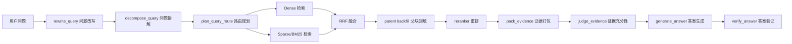

# RAG 检索与生成评估完整流程

本文档整理当前 `Veritas RAG` 项目的完整 RAG 评估方案，覆盖两条主线：

- **检索阶段评估**：评估 Dense、Sparse/BM25、RRF 融合、Reranker 是否能把正确证据找回来并排到前面。
- **生成阶段评估**：评估系统最终生成答案是否正确、忠实、相关，引用上下文是否充分，Agentic 流程是否稳定。

当前项目已经具备两类可运行评估脚本：

| 阶段 | 脚本 | 数据集 |
| --- | --- | --- |
| 检索评估 | `backend/evaluation/import_t2retrieval_dataset.py` + `backend/evaluation/run_t2retrieval_eval.py` | `mteb/T2Retrieval` |
| 生成评估 | `backend/evaluation/import_hotpotqa_dataset.py` + `backend/evaluation/run_ragas_answer_eval.py` | `hotpotqa/hotpot_qa` + RAGAS |

推荐使用 `cook-rag-1` 环境运行：

```powershell
D:\Software\anaconda3\envs\cook-rag-1\python.exe ...
```

## 1. 当前项目评估对象

当前 Agentic RAG 链路大致如下：



评估时不要只看最终答案。最终答案差可能来自：

- 分块切错。
- embedding 召回不到。
- sparse 分词不适配。
- RRF 权重不合理。
- reranker 把正确证据排低。
- 证据打包漏掉关键信息。
- 生成模型没有按证据回答。
- Agentic 反思流程不收敛。

所以要分成“检索评估”和“生成评估”两条线。

## 2. 推荐数据集

### 2.1 检索阶段数据集

检索评估需要 `query -> relevant documents`，也就是 qrels 标注。

| 数据集 | 适合什么 | 当前项目是否接入 | 说明 |
| --- | --- | --- | --- |
| `mteb/T2Retrieval` | 中文文本检索、Dense/Sparse/RRF/Reranker | 已接入 | 当前项目首选检索评估集 |
| BEIR | 英文多领域检索、NDCG/Recall/MAP | 可扩展 | 经典 IR benchmark |
| MS MARCO Passage Ranking | Passage 检索与重排 | 可扩展 | 常用于训练/评估 reranker |
| 自建业务 qrels | 真实业务检索 | 推荐建设 | 最能代表项目效果 |

当前项目已使用：

```text
data/evaluation/t2retrieval/
```

对应脚本：

```text
backend/evaluation/t2retrieval.py
backend/evaluation/import_t2retrieval_dataset.py
backend/evaluation/run_t2retrieval_eval.py
```

### 2.2 生成阶段数据集

生成评估需要 `question + reference answer + evidence/context`。

| 数据集 | 适合什么 | 当前项目是否接入 | 说明 |
| --- | --- | --- | --- |
| HotpotQA | 多跳问答、答案生成、证据忠实性 | 已接入 | 当前项目首选生成评估集 |
| QASPER | 长文档问答、论文证据问答 | 可扩展 | 适合长文档 RAG |
| ASQA | 长答案生成、多答案聚合 | 可扩展 | 适合开放式长答案 |
| Natural Questions | 开放域问答 | 可扩展 | 答案通常较短 |
| 自建 QA 集 | 真实业务答案质量 | 推荐建设 | 最贴合项目场景 |

当前项目已接入：

```text
hotpotqa/hotpot_qa
```

生成样本文件：

```text
data/evaluation/hotpotqa_ragas_samples.jsonl
```

对应脚本：

```text
backend/evaluation/import_hotpotqa_dataset.py
backend/evaluation/run_ragas_answer_eval.py
```

## 3. 检索阶段评估指标

检索阶段的目标是：正确证据是否被召回，是否排在前面。

### 3.1 Hit@K

Top-K 中是否至少有一个相关文档。

```text
Hit@K = 1 if Top-K 中存在相关文档 else 0
```

含义：

- 适合判断“有没有捞到至少一个能回答的证据”。
- 对 RAG 很重要，因为很多问题只需要一个关键证据即可回答。

### 3.2 Recall@K

所有相关文档中，有多少被 Top-K 召回。

```text
Recall@K = Top-K 中相关文档数 / 全部相关文档数
```

含义：

- 衡量召回是否完整。
- 如果 `Recall@50` 都低，优先查分块、embedding、query rewrite。
- 如果 `Recall@50` 高但 `MRR@10` 低，说明召回够了但排序差。

### 3.3 MRR@K

第一个相关文档排得越靠前，分数越高。

```text
RR = 1 / 第一个相关文档排名
MRR = 多个 query 的 RR 平均
```

含义：

- 适合评估 reranker。
- RAG 的上下文通常只取前几个结果，所以第一个正确证据的位置很关键。

### 3.4 NDCG@K

衡量高相关文档是否排在前面。

```text
NDCG@K = DCG@K / IDCG@K
```

含义：

- 支持多级相关性。
- 越接近 1，排序越接近理想排序。

### 3.5 Precision@K

Top-K 中有多少比例是相关结果。

```text
Precision@K = Top-K 中相关文档数 / K
```

含义：

- 衡量上下文是否干净。
- Precision 低会导致 LLM 被无关内容干扰。

当前 `run_t2retrieval_eval.py` 已实现：

- `hit@K`
- `recall@K`
- `mrr@K`
- `ndcg@K`

## 4. 生成阶段评估指标

生成阶段的目标是：最终答案是否正确、忠实、相关。

当前项目使用 RAGAS 评估：

```text
backend/evaluation/run_ragas_answer_eval.py
```

默认指标：

```text
faithfulness
answer_relevancy
context_precision
context_recall
answer_correctness
```

### 4.1 Faithfulness

答案是否被给定上下文支持。

高分表示：

- 答案没有明显编造。
- 答案中的陈述可以从 retrieved contexts 推出。

低分常见原因：

- LLM 使用自身知识扩写。
- 证据不足但模型硬答。
- 引用证据和答案结论不匹配。

### 4.2 Answer Relevancy

答案是否回答了用户问题。

高分表示：

- 答案围绕问题本身。
- 没有明显跑题。

低分常见原因：

- query rewrite 改偏了。
- decomposition 拆错了。
- 生成答案过度解释但没有回答核心问题。

### 4.3 Context Precision

给模型的上下文中，有多少是相关的。

高分表示：

- pack_evidence 选出的上下文比较干净。
- reranker 排序较好。

低分常见原因：

- 检索结果噪声多。
- RRF 融合引入了不相关候选。
- top_k 过大，塞入太多无关证据。

### 4.4 Context Recall

标准答案需要的信息，有多少进入了上下文。

高分表示：

- 检索阶段确实找到了能回答问题的证据。
- parent backfill 和证据打包没有漏掉关键信息。

低分常见原因：

- 召回不足。
- 正确 chunk 被 reranker 排掉。
- 证据打包时只截取了无关片段。

### 4.5 Answer Correctness

最终答案和标准答案是否一致。

高分表示：

- 答案语义上接近 reference answer。

低分常见原因：

- 模型答得太长，和短标准答案形式差异大。
- 答案包含部分正确但最终结论不够直接。
- 标准答案是 `yes/no` 或实体名，但模型输出了长解释。

在 HotpotQA 上要特别注意：标准答案通常非常短，例如 `yes`、`Chief of Protocol`、`Animorphs`，而当前系统会生成“分解式中文长答案”。这会拉低 `answer_correctness`，但不一定说明答案完全不可用，需要结合样本人工看。

## 5. 检索评估完整流程

### 5.1 导入 T2Retrieval

首次运行或重新构建评估库：

```powershell
D:\Software\anaconda3\envs\cook-rag-1\python.exe backend/evaluation/import_t2retrieval_dataset.py --download --user-id 1 --kb-name public_eval_t2retrieval --limit-corpus 1000 --limit-gold-queries 50 --clean-existing
```

参数说明：

| 参数 | 含义 |
| --- | --- |
| `--download` | 下载 T2Retrieval 数据文件 |
| `--user-id` | 导入到哪个用户下，默认 1 |
| `--kb-name` | 评估知识库名称 |
| `--limit-corpus` | 导入文档数量 |
| `--limit-gold-queries` | 选择多少带 gold doc 的 query |
| `--clean-existing` | 删除同名旧评估知识库后重建 |

导入成功后会输出：

```text
kb_id=...
selected_docs=...
parent_chunks=...
child_chunks=...
```

### 5.2 运行检索评估

```powershell
D:\Software\anaconda3\envs\cook-rag-1\python.exe backend/evaluation/run_t2retrieval_eval.py --kb-id 你的KB_ID --limit-queries 50 --top-k 10 --dense-top-k 50 --bm25-top-k 50 --rerank-candidates 50
```

如果 reranker 很慢，可以先跳过：

```powershell
D:\Software\anaconda3\envs\cook-rag-1\python.exe backend/evaluation/run_t2retrieval_eval.py --kb-id 你的KB_ID --limit-queries 50 --top-k 10 --skip-reranker
```

### 5.3 查看报告

报告输出到：

```text
data/evaluation/reports/t2retrieval_eval_kb{kb_id}_{timestamp}.json
```

重点看：

```json
{
  "summary": {
    "dense": {},
    "bm25": {},
    "rrf": {},
    "rerank": {}
  },
  "per_query": []
}
```

诊断方式：

| 现象 | 说明 | 优先排查 |
| --- | --- | --- |
| Dense 低、BM25 也低 | 召回整体有问题 | 数据导入、doc_id、分块、embedding |
| Dense 高、BM25 低 | 语义检索有效，关键词检索弱 | sparse tokenizer、BM25 参数 |
| BM25 高、Dense 低 | 关键词有效，embedding 弱 | embedding 模型、query rewrite |
| RRF 低于单路 | 融合策略有问题 | RRF 权重、候选池大小 |
| Rerank 低于 RRF | reranker 不适配 | reranker 模型、输入文本、parent backfill |
| Recall 高但 MRR 低 | 召回到了但排序差 | reranker、融合排序 |

### 5.4 当前检索评估结果

当前项目已经跑过一批 T2Retrieval （20条）检索评估：

```text
report=E:\PythonProject\Veritas-RAG\data\evaluation\reports\t2retrieval_eval_kb5_20260504_153143.json
dataset=mteb/T2Retrieval
kb_id=5
limit_queries=20
top_k=10
dense_top_k=50
bm25_top_k=50
rerank_candidates=50
skip_reranker=false
seconds=29.888
```

汇总指标：

| 检索阶段 | Hit@10 | Recall@10 | MRR@10 | NDCG@10 |
| --- | ---: | ---: | ---: | ---: |
| Dense | 0.9500 | 0.9000 | 0.9500 | 0.9101 |
| BM25 / Sparse | 0.9000 | 0.8167 | 0.8417 | 0.7889 |
| RRF 融合 | 0.9500 | 0.9000 | 0.9167 | 0.8778 |
| Rerank | 0.9500 | 0.9167 | 0.9167 | 0.8905 |

指标解读：

- **Dense 表现最好**：`MRR@10=0.95`、`NDCG@10=0.9101`，说明当前 BGE-M3 dense embedding 在这批中文检索样本上能把正确文档排得很靠前。
- **BM25/Sparse 也有效，但弱于 Dense**：`Hit@10=0.9`、`Recall@10=0.8167`，说明关键词检索能补充一部分字面匹配，但整体排序和召回低于 dense。
- **RRF 融合保持了 Dense 的召回水平**：`Hit@10=0.95`、`Recall@10=0.9`，但 `MRR@10` 和 `NDCG@10` 比 Dense 略低，说明融合引入 BM25 结果后增加了部分噪声。
- **Rerank 提升了 Recall@10**：从 RRF 的 `0.9000` 提到 `0.9167`，说明 reranker 对候选排序有一定帮助。
- **Rerank 没有超过 Dense 的 MRR/NDCG**：这提示当前 reranker 或 rerank 输入文本可能还可以优化，尤其是 parent content、title、section 信息拼接方式。

从这批结果看，当前检索链路的基础召回能力是比较好的，瓶颈主要不在“找不到证据”，而在：

1. RRF 融合后排序略有稀释。
2. Reranker 对排序质量的提升不够明显。
3. 后续生成阶段的 `answer_correctness` 偏低，更多是答案表达形式、Agentic 反思稳定性和 HotpotQA 短答案格式适配问题。

### 5.5 清理检索评估库

```powershell
D:\Software\anaconda3\envs\cook-rag-1\python.exe backend/evaluation/cleanup_eval_kb.py --kb-id 你的KB_ID
```

## 6. 生成评估完整流程

### 6.1 安装依赖

`backend/requirements.txt` 已加入：

```text
ragas>=0.2.14,<0.4.0
datasets>=2.16.0
pandas>=2.0.0
pyarrow>=14.0.0
```

安装：

```powershell
D:\Software\anaconda3\envs\cook-rag-1\python.exe -m pip install -r backend/requirements.txt
```

当前环境已经验证过：

```text
ragas=0.3.9
langgraph=1.0.1
```

### 6.2 确认 LLM 服务可用

生成评估会调用两次 LLM：

- 当前 RAG 系统生成答案。
- RAGAS 作为评估器打分。

先测试：

```powershell
D:\Software\anaconda3\envs\cook-rag-1\python.exe -c "import sys; sys.path.insert(0,'backend'); from graph.llm_factory import get_llm; print(get_llm().invoke('ping, reply with pong').content)"
```

如果返回：

```text
pong
```

说明 LLM 服务可用。

如果出现：

```text
APIConnectionError
auth_unavailable
```

需要检查 `.env` 或 `backend/core/config.py` 中：

```text
LLM_BASE_URL / BASE_URL
LLM_API_KEY
LLM_MODEL
```

当前项目只读取根目录 `.env`，不再读取 `backend/.env`。

不要再维护第二份：

```text
backend/.env
```

原因是两份配置容易互相覆盖。之前出现过 `backend/.env` 把模型覆盖成错误模型的问题，所以现在统一成根目录 `.env` 一个来源。

RAGAS evaluator 也走同一个 OpenAI-compatible 服务，但使用更稳的评估配置：

```text
RAGAS_LLM_TEMPERATURE=0.0
RAGAS_BATCH_SIZE=2
RAGAS_RUN_MAX_WORKERS=4
RAGAS_RUN_MAX_RETRIES=5
```

大白话：RAGAS 打分要求模型稳定输出结构化结果，所以温度要低、并发要小。

### 6.3 导入 HotpotQA 生成评估集

导入 200 条：

```powershell
D:\Software\anaconda3\envs\cook-rag-1\python.exe backend/evaluation/import_hotpotqa_dataset.py --limit-examples 200 --user-id 1 --clean-existing
```

脚本会：

- 下载或使用缓存的 `hotpotqa/hotpot_qa`。
- 创建知识库 `public_eval_hotpotqa_generation`。
- 把 HotpotQA context 段落导入 MySQL + Chroma。
- 生成 RAGAS 样本文件。

输出示例：

```text
kb_id=7
examples=200
documents=1991
parent_chunks=1992
child_chunks=2000
sample_output=E:\PythonProject\Veritas-RAG\data\evaluation\hotpotqa_ragas_samples.jsonl
sample_count=200
```

当前已导入的 200 条数据：

```text
kb_id=7
samples=200
docs=1991
chunks=3992
```

样本文件：

```text
data/evaluation/hotpotqa_ragas_samples.jsonl
```

### 6.4 先小批量运行 RAGAS

建议先跑 10 条：

```powershell
D:\Software\anaconda3\envs\cook-rag-1\python.exe backend/evaluation/run_ragas_answer_eval.py --input data/evaluation/hotpotqa_ragas_samples.jsonl --kb-id 7 --user-id 1 --top-k 6 --limit 10
```

也可以显式指定指标：

```powershell
D:\Software\anaconda3\envs\cook-rag-1\python.exe backend/evaluation/run_ragas_answer_eval.py --input data/evaluation/hotpotqa_ragas_samples.jsonl --kb-id 7 --user-id 1 --top-k 6 --limit 10 --metrics faithfulness,answer_relevancy,context_precision,context_recall,answer_correctness
```

### 6.5 扩大批量

建议分批跑：

```powershell
# 20 条
D:\Software\anaconda3\envs\cook-rag-1\python.exe backend/evaluation/run_ragas_answer_eval.py --input data/evaluation/hotpotqa_ragas_samples.jsonl --kb-id 7 --user-id 1 --top-k 6 --limit 20

# 50 条
D:\Software\anaconda3\envs\cook-rag-1\python.exe backend/evaluation/run_ragas_answer_eval.py --input data/evaluation/hotpotqa_ragas_samples.jsonl --kb-id 7 --user-id 1 --top-k 6 --limit 50
```

不建议一上来直接跑 200 条，原因：

- RAGAS 每条样本会多次调用评估 LLM。
- Agentic RAG 每条样本本身也会调用 LLM。
- 少数样本可能触发反思循环，耗时较长。
- 本地评估模型可能出现临时 `auth_unavailable` 或 503。

如果 10、20、50 条都稳定，再跑完整 200 条：

```powershell
D:\Software\anaconda3\envs\cook-rag-1\python.exe backend/evaluation/run_ragas_answer_eval.py --input data/evaluation/hotpotqa_ragas_samples.jsonl --kb-id 7 --user-id 1 --top-k 6
```

### 6.6 只收集答案，不跑 RAGAS

用于先检查 RAG 生成是否稳定：

```powershell
D:\Software\anaconda3\envs\cook-rag-1\python.exe backend/evaluation/run_ragas_answer_eval.py --input data/evaluation/hotpotqa_ragas_samples.jsonl --kb-id 7 --user-id 1 --top-k 6 --limit 20 --collect-only
```

## 7. 生成评估报告怎么看

报告输出到：

```text
data/evaluation/reports/ragas_answer_eval_kb{kb_id}_{timestamp}.json
```

报告结构：

```json
{
  "config": {},
  "seconds": 123,
  "sample_count": 10,
  "success_count": 8,
  "ragas": {
    "summary": {}
  },
  "samples": []
}
```

### 7.1 当前 HotpotQA 稳定性回归结果

之前旧报告里出现过 recursion limit：

```text
report=data/evaluation/reports/ragas_answer_eval_kb7_20260618_111359.json
sample_count=20
success_count=15
recursion_errors=5
```

原因不是模型完全不可用，而是 reflection 到上限时没有及时收口，部分样本会继续回到检索/反思链路，最后撞到 LangGraph 默认 recursion limit。

修复后先跑 collect-only，也就是只跑真实 RAG 链路，不调用 RAGAS evaluator：

```text
report=data/evaluation/reports/ragas_answer_eval_kb7_20260618_114555.json
sample_count=20
success_count=20
recursion_errors=0
```

这个结果说明：

- RAG 主流程可以跑完。
- 第 3、15、16、19、20 条这些之前失败的样本已经通过。
- recursion limit 问题已经消失。

然后跑 5 条完整 RAGAS：

```text
report=data/evaluation/reports/ragas_answer_eval_kb7_20260618_122319.json
sample_count=5
success_count=5
faithfulness=0.7813
answer_relevancy=0.3452
llm_context_precision_with_reference=0.4400
context_recall=1.0000
answer_correctness=0.2576
missing_values=0
```

解释：

- `context_recall=1.0`：这 5 条里，标准答案需要的信息都进了上下文。
- `context_precision=0.44`：上下文里仍有噪声，证据筛选还有优化空间。
- `answer_correctness` 偏低：HotpotQA 标准答案通常很短，当前系统输出长中文解释，形式差异会拉低分。
- `answer_relevancy` 偏低：答案有时绕得比较多，没有先给短答案。
- `missing_values=0`：RAGAS evaluator 已经稳定出分，没有空指标。

### 7.2 常见失败原因

| 现象 | 原因 | 处理 |
| --- | --- | --- |
| `GRAPH_RECURSION_LIMIT` | 反思/检索循环没有及时收口 | 检查 `reflection_nodes.py`、`route_verification`、`GRAPH_RECURSION_LIMIT` |
| RAGAS 指标 `nan` 或空值 | 评估 LLM 调用失败或 parser 失败 | 检查 LLM 服务，降低 `RAGAS_BATCH_SIZE / RAGAS_RUN_MAX_WORKERS` |
| `auth_unavailable` | 本地模型服务鉴权/供应方不可用 | 重启模型服务，或切换可用模型 |
| `answer_correctness` 低 | 长答案 vs 短标准答案形式差异 | 增加“先给短答案，再解释”的生成约束 |
| `context_precision` 低 | 上下文噪声多 | 优化 reranker、top_k、证据去重 |
| `context_recall` 低 | 关键证据没进入上下文 | 优化检索召回、chunk、RRF、parent backfill |

## 8. 如何搭建完整评估流水线

建议按下面顺序搭建：

### 8.1 第一步：固定数据集版本

检索：

```text
mteb/T2Retrieval
```

生成：

```text
hotpotqa/hotpot_qa
```

业务评估：

```text
data/evaluation/business_qa.jsonl
```

业务样本建议格式：

```json
{"id":"biz_001","question":"红烧肉怎么做才不柴？","ground_truth":"选择带皮五花肉，焯水后小火慢炖，避免大火久煮。","gold_doc_ids":["doc_xxx"],"question_type":"技巧解释"}
```

### 8.2 第二步：分别跑检索和生成

先跑检索：

```powershell
D:\Software\anaconda3\envs\cook-rag-1\python.exe backend/evaluation/run_t2retrieval_eval.py --kb-id 你的检索KB --limit-queries 50 --top-k 10
```

再跑生成：

```powershell
D:\Software\anaconda3\envs\cook-rag-1\python.exe backend/evaluation/run_ragas_answer_eval.py --input data/evaluation/hotpotqa_ragas_samples.jsonl --kb-id 7 --limit 20
```

### 8.3 第三步：按失败类型归因

如果生成评估差，不要马上调 prompt，先看：

1. `context_recall` 低：检索阶段问题。
2. `context_precision` 低：排序/证据筛选问题。
3. `faithfulness` 低：生成幻觉或证据约束不足。
4. `answer_relevancy` 低：问题改写/拆解/生成跑偏。
5. `answer_correctness` 低但 faithfulness 高：答案形式、语言、简洁性和标准答案不匹配。

### 8.4 第四步：形成 baseline

保存每次报告：

```text
data/evaluation/reports/
```

命名中已经包含：

- 数据集类型。
- `kb_id`。
- 时间戳。

建议记录：

| 字段 | 示例 |
| --- | --- |
| embedding | BGE-M3 |
| reranker | BGE reranker v2 m3 |
| top_k | 6 |
| dense_top_k | 50 |
| bm25_top_k | 50 |
| RRF k | 60 |
| LLM | gpt-5.4 compatible |
| 数据集 | HotpotQA validation distractor |
| 样本数 | 10/20/50/200 |

### 8.5 第五步：持续对比

每次修改下面内容都应该重跑：

- chunk size / overlap。
- embedding 模型。
- sparse tokenizer。
- RRF 权重。
- reranker 模型。
- top_k。
- query rewrite prompt。
- decomposition prompt。
- evidence judge 阈值。
- generate_answer prompt。
- verify_answer prompt。

## 9. 推荐评估实验矩阵

不要一次改一堆参数。一次只改一个点，然后用同一批数据重跑。

| 实验 | 主要看什么 |
| --- | --- |
| child chunk size 200 / 300 / 500 | recall@10、context_recall |
| parent chunk size 800 / 1200 / 1600 | faithfulness、answer_correctness |
| dense only / sparse only / dense+sparse | 哪路召回真正有贡献 |
| RRF dense 权重 0.4 / 0.5 / 0.7 | fusion 是否比单路更好 |
| reranker 开 / 关 | mrr@10、ndcg@10、延迟 |
| top_k 4 / 6 / 10 | context_precision 和答案质量 |
| decomposition 开 / 关 | 多跳问题是否提升 |
| reflection 0 / 1 / 3 次 | 成功率、延迟、recursion 风险 |
| web_search 开 / 关 | 时效问题和外部信息问题 |
| 短答案 prompt 开 / 关 | HotpotQA answer_correctness |

大白话：评估不是为了追一个漂亮平均分，而是为了知道“改了哪里，哪里变好，哪里变坏”。

## 10. 最重要的落地原则

1. **先看检索，再看答案。** 正确证据没进上下文，生成模型再强也只能猜。
2. **公开数据集和业务数据集都要有。** HotpotQA 可以做回归，业务 QA 才能说明真实可用性。
3. **失败样本比平均分更重要。** 平均分只能告诉你大概水平，失败样本才能告诉你该改哪里。
4. **RAGAS 不是唯一裁判。** RAGAS 适合自动化回归，但上线前仍要人工抽检。
5. **指标要和延迟一起看。** reranker、reflection、web_search 都可能提质，也会增加耗时。
6. **每次实验要可复现。** 固定数据集、kb_id、top_k、模型、报告文件，再做前后对比。

## 11. 当前项目下一步建议

### 11.1 短期

- 保留 200 条 HotpotQA 知识库 `kb_id=7` 作为生成评估基准。
- 先按 `--limit 10`、`--limit 20`、`--limit 50` 分批跑。
- `GRAPH_RECURSION_LIMIT` 已做过一轮修复，后续继续用 collect-only 做回归，确保新改动不会让 reflection 再次失控。
- 补一份真实业务 QA 评估集，不要只依赖 HotpotQA。

### 11.2 中期

- 在 `run_t2retrieval_eval.py` 中补充 `precision@K`、`map@K`。
- 在 `run_ragas_answer_eval.py` 中增加 `--offset`，支持分批跑 0-50、50-100、100-150。
- 增加“短答案模式”评估 prompt，适配 HotpotQA 这类短答案 benchmark。
- 给业务 QA 集增加 `question_type`，按类型分别看分数，比如无答案、表格数字、版本日期、多文档综合。

### 11.3 长期

- 建设项目自己的业务 QA 评估集。
- 把检索报告和生成报告汇总成 dashboard。
- 发布前固定跑一批 50-100 条 smoke/regression eval。

## 12. 常用命令速查

### 检查 LLM

```powershell
D:\Software\anaconda3\envs\cook-rag-1\python.exe -c "import sys; sys.path.insert(0,'backend'); from graph.llm_factory import get_llm; print(get_llm().invoke('ping, reply with pong').content)"
```

### 导入检索评估集

```powershell
D:\Software\anaconda3\envs\cook-rag-1\python.exe backend/evaluation/import_t2retrieval_dataset.py --download --user-id 1 --kb-name public_eval_t2retrieval --limit-corpus 1000 --limit-gold-queries 50 --clean-existing
```

### 跑检索评估

```powershell
D:\Software\anaconda3\envs\cook-rag-1\python.exe backend/evaluation/run_t2retrieval_eval.py --kb-id 你的KB_ID --limit-queries 50 --top-k 10
```

### 导入生成评估集 200 条

```powershell
D:\Software\anaconda3\envs\cook-rag-1\python.exe backend/evaluation/import_hotpotqa_dataset.py --limit-examples 200 --user-id 1 --clean-existing
```

### 跑生成评估 10 条

```powershell
D:\Software\anaconda3\envs\cook-rag-1\python.exe backend/evaluation/run_ragas_answer_eval.py --input data/evaluation/hotpotqa_ragas_samples.jsonl --kb-id 7 --user-id 1 --top-k 6 --limit 10
```

### 只收集答案

```powershell
D:\Software\anaconda3\envs\cook-rag-1\python.exe backend/evaluation/run_ragas_answer_eval.py --input data/evaluation/hotpotqa_ragas_samples.jsonl --kb-id 7 --user-id 1 --top-k 6 --limit 20 --collect-only
```
