# RAG 评估体系与落地指南

本文档面向当前 `Veritas RAG` / Agentic RAG 项目，系统说明 RAG 从数据准备、索引构建、检索、重排、证据打包、答案生成到 Agentic 流程的评估方法。重点不是“看起来回答不错”，而是把每个阶段拆开评估，定位瓶颈，形成可复现实验。

## 1. 当前项目的 RAG 链路

当前项目是一个基于 FastAPI + LangChain + LangGraph + Chroma + MySQL 的 Agentic RAG 系统。核心流程可以理解为：

```mermaid
flowchart LR
    A[用户问题] --> B[load_memory 加载记忆]
    B --> C[rewrite_query 问题改写]
    C --> D[decompose_query 问题拆解]
    D --> E[plan_query_route 路由规划]
    E --> F[retrieve Dense + Sparse]
    F --> G[RRF 融合]
    G --> H[parent backfill 父块回填]
    H --> I[rerank 候选重排]
    I --> J[pack_evidence 证据打包]
    J --> K[judge_evidence 证据充分性判断]
    K --> L[generate_answer 生成答案]
    L --> M[verify_answer 答案验证]
    M --> N[write_memory 写入记忆]
```



项目里已经有一套真实检索链路评估脚本：

- `backend/evaluation/t2retrieval.py`：加载 `mteb/T2Retrieval` 数据集。
- `backend/evaluation/import_t2retrieval_dataset.py`：把公开评估数据导入项目真实 MySQL + Chroma 存储。
- `backend/evaluation/run_t2retrieval_eval.py`：分别评估 `dense`、`bm25/sparse`、`rrf`、`rerank` 的检索效果。
- `backend/evaluation/cleanup_eval_kb.py`：清理评估知识库。

也就是说，当前项目不是只用离线向量库做 toy demo，而是可以把公开数据导入真实知识库，再走项目自己的检索服务 `backend/services/retrieval/hybrid.py` 和 reranker `backend/services/retrieval/reranker.py` 来评估。

## 2. 总体评估原则

RAG 评估要分层做，不能只看最终答案。因为最终答案差，可能是任何阶段造成的：

- 数据质量差：文档重复、乱码、结构丢失、OCR 错误、元数据错误。
- 分块差：chunk 过长导致噪声多，过短导致上下文断裂，父子块映射错。
- embedding 差：语义召回不稳，中文、菜谱、口语表达覆盖不足。
- sparse/BM25 差：关键词、菜名、食材、步骤编号等字面匹配失败。
- 融合差：RRF 权重不合适，dense 与 sparse 互相稀释。
- rerank 差：候选足够好但重排把正确证据压下去。
- 证据打包差：检索到了，但给 LLM 的证据片段不完整。
- 生成差：证据充分但答案不忠实、漏答、不引用。
- Agentic 决策差：该检索时走了闲聊，该联网时没联网，该反思时直接回答。

建议把评估分成三层：

1. **离线组件评估**：不调用最终 LLM，只测数据、索引、检索、rerank。优点是便宜、稳定、可重复。
2. **端到端 RAG 评估**：输入问题，输出答案和引用，测正确性、忠实性、答案相关性、引用质量。
3. **线上观测评估**：真实用户日志、反馈、延迟、成本、无答案率、修正率、人工抽检。

## 3. 各阶段如何评估

### 3.1 数据准备阶段

对应项目模块：

- 旧版示例模块：`rag_modules/data_preparation.py`
- 后端入库链路：`backend/services/ingestion/`
- 多模态 OCR：`backend/services/vision/ocr.py`

这一阶段评估的是“进入知识库的数据是否值得被检索”。

常见检查项：

| 评估对象 | 指标 | 含义 | 项目里怎么做 |
| --- | --- | --- | --- |
| 文档加载 | parse_success_rate | 成功解析文档数 / 总文档数 | 记录每个文件解析状态 |
| 文本质量 | empty_doc_rate | 空文档比例 | 入库前检查 `content.strip()` |
| 编码质量 | garbled_text_rate | 乱码、不可读字符比例 | 抽样检查中文字符占比、异常字符 |
| 去重质量 | duplicate_rate | 重复文档或重复段落比例 | 用 `file_hash`、SimHash、MinHash |
| 元数据质量 | metadata_completeness | `title/category/source/page_no` 等字段完整率 | 检查 MySQL `DocumentTable`、`ChunkTable` |
| OCR 质量 | ocr_error_rate | 图片识别文本错误比例 | 人工标注小样本对比 |

对于菜谱类知识库，建议额外检查：

- 菜名是否提取正确。
- 分类是否正确，例如荤菜、素菜、汤品、主食、甜品。
- 难度、时间、食材、步骤是否被保留。
- 同一道菜不同版本是否被误删或误合并。
- 图片 OCR 的食材表、步骤编号是否错乱。

重点：数据阶段不追求“指标越多越好”，而是先保证三件事：

1. 文档没有丢。
2. 结构没有碎。
3. 元数据可以用于过滤和引用。

### 3.2 分块阶段

对应项目能力：

- 父子 chunk 设计：检索 child chunk，回答时回填 parent chunk。
- `hybrid.py` 里 `_parent_backfill_sync` 会把子块命中的父块内容补回来。

分块直接影响召回和答案忠实性。常见评估指标：

| 指标 | 含义 | 为什么重要 |
| --- | --- | --- |
| avg_chunk_tokens | 平均 chunk token 数 | 太短容易断语义，太长噪声高 |
| p95_chunk_tokens | 95 分位 chunk 长度 | 识别异常长块 |
| chunk_overlap_ratio | 相邻 chunk 重叠比例 | 过低丢上下文，过高浪费向量库 |
| parent_child_integrity | 子块是否都能找到父块 | 当前项目依赖 parent backfill |
| gold_span_coverage | 标准答案所需证据是否完整落在某个 chunk 或 parent 内 | 判断分块是否切断答案 |
| section_preservation | 标题层级、页码、章节是否保留 | 影响引用和答案组织 |

推荐做法：

- 用 50-100 个高频问题做小型标注集，给每个问题标注“应该命中的文档/段落/句子”。
- 对不同 chunk size、overlap、按标题分块、父子块策略进行 AB 测试。
- 优先观察 `Recall@20`、`Recall@50`，因为分块阶段的目标是“正确证据至少能被召回进候选池”。

### 3.3 索引与 Embedding 阶段

对应项目模块：

- `backend/embeddings/`
- `backend/db/chroma/`
- 旧版示例：`rag_modules/index_construction.py`

这一阶段评估 embedding 模型、向量维度、归一化、索引参数是否适合当前知识库。

常见指标：

| 指标 | 含义 |
| --- | --- |
| embedding_success_rate | 成功生成向量的 chunk 比例 |
| vector_dimension_match | 向量维度是否与配置一致，例如 `EMBEDDING_DIMENSION=1024` |
| index_document_count | Chroma 中向量数量是否与 child chunk 数一致 |
| query_embedding_latency | 单条 query embedding 耗时 |
| batch_embedding_latency | 批量入库 embedding 耗时 |
| dense_recall@k | 只用 dense 检索时，Top-K 是否包含相关文档 |

重点：Embedding 评估不要只看模型 leaderboard。要看它在当前领域的表现。菜谱类问题有很多实体、食材、做法、口语表达，dense 模型可能理解“怎么让红烧肉不柴”，但 sparse 检索更擅长“红烧肉”“五花肉”“冰糖”这类字面匹配。

### 3.4 Sparse / BM25 阶段

对应项目模块：

- `backend/embeddings/sparse.py`
- `backend/services/retrieval/hybrid.py` 中 `_sparse_retrieve_async`
- 旧版示例：`rag_modules/retrieval_optimization.py`

Sparse 检索评估重点是关键词、实体、精确术语。

常见指标：

| 指标 | 含义 |
| --- | --- |
| bm25_hit@k | Top-K 中是否至少命中一个相关文档 |
| bm25_recall@k | 召回了多少相关文档 |
| term_coverage | query 中关键术语在候选文档中覆盖情况 |
| zero_result_rate | sparse 检索无结果比例 |

适合 sparse 的问题：

- 精确菜名：`鱼香肉丝怎么做`
- 明确食材：`土豆 牛肉 能做什么`
- 专有名词：`空气炸锅 鸡翅`
- 数字、时间、步骤：`蒸蛋 10 分钟`

### 3.5 混合检索与 RRF 融合阶段

对应项目核心：

- `backend/services/retrieval/hybrid.py`
- `_dense_retrieve_async`
- `_sparse_retrieve_async`
- `_fuse_multi_query_results`
- `_parent_backfill_sync`

当前项目使用 dense + sparse + weighted RRF。RRF 的基本思想是：不直接比较不同检索器的原始分数，而是按排名融合。

公式可以简化为：

```text
RRF_score(d) = sum( weight_i / (k + rank_i(d)) )
```

其中：

- `d` 是候选文档或 chunk。
- `rank_i(d)` 是该文档在第 `i` 个检索器结果里的排名。
- `k` 是平滑参数，项目里默认 `k=60`。
- `weight_i` 是检索器权重，当前项目 dense 权重约为 `1.0`，sparse 权重约为 `0.9`。

为什么用 RRF：

- dense 分数和 BM25 分数尺度不同，直接加权容易失真。
- RRF 只关心排名，工程上更稳。
- 一个文档如果同时被 dense 和 sparse 排在前面，会得到更高融合分。

评估时要分别看：

| 对比项 | 目的 |
| --- | --- |
| dense vs sparse | 判断语义检索和关键词检索谁贡献更大 |
| dense vs rrf | 判断 sparse 是否补充了 dense 漏召回 |
| sparse vs rrf | 判断 dense 是否补充了关键词检索不足 |
| rrf vs rerank | 判断 reranker 是否真正改善排序 |

当前项目 `run_t2retrieval_eval.py` 已经按 `dense`、`bm25`、`rrf`、`rerank` 分桶输出指标，这是非常好的诊断方式。

### 3.6 Reranker 阶段

对应项目模块：

- `backend/services/retrieval/reranker.py`
- 默认可使用 `BAAI/bge-reranker-v2-m3`
- fallback：`SimpleReranker`

Reranker 的作用不是扩大召回，而是在候选池里把最相关证据排到前面。所以评估时重点看排序指标：

| 指标 | 含义 |
| --- | --- |
| MRR@k | 第一个相关文档越靠前越好 |
| NDCG@k | 高相关文档是否排在更前面 |
| Hit@k | Top-K 是否命中相关文档 |
| Recall@k | Top-K 覆盖了多少相关文档 |
| rerank_delta | rerank 指标 - RRF 指标 |

如果 `Recall@50` 很高，但 `MRR@10` 很低，说明“召回到了，但排序差”，适合优化 reranker。如果 `Recall@50` 本身低，先优化 query rewrite、embedding、chunk、hybrid 检索，不要急着调 reranker。

### 3.7 证据打包阶段

对应项目节点：

- `pack_evidence`
- `judge_evidence`

这一层是很多 RAG 项目容易忽略的重点。检索到正确 chunk 不代表 LLM 真的看到了足够证据，因为上下文窗口有限，证据需要被裁剪、排序、去重、引用编号。

常见指标：

| 指标 | 含义 |
| --- | --- |
| context_precision | 给 LLM 的上下文中，有多少是真正相关的 |
| context_recall | 标准答案所需证据，有多少被放进上下文 |
| evidence_coverage_score | 每个子问题是否有足够证据覆盖 |
| answerability_score | 仅凭当前证据是否能回答 |
| citation_coverage | 答案关键结论是否都有引用 |
| token_utilization | 有用证据 token / 总上下文 token |
| duplicate_context_rate | 重复证据比例 |

RAGAS、LlamaIndex、LangSmith 等工具都强调把 retrieval/context 与 answer 分开评估。原因很简单：答案幻觉不一定是生成模型错，也可能是上下文里根本没有答案。

### 3.8 答案生成阶段

对应项目节点：

- `generate_answer`
- `_build_citations`
- `_extract_cited_evidence_ids`

答案生成评估通常分两类：

1. 有标准答案：用 EM、F1、ROUGE、语义相似度、LLM-as-judge 正确性。
2. 没有标准答案：用 faithfulness、answer relevance、context relevance、人工抽检。

常见指标：

| 指标 | 含义 |
| --- | --- |
| Exact Match | 预测答案是否与标准答案完全一致，适合短事实答案 |
| Token F1 | 预测答案和标准答案 token 重叠 F1 |
| Semantic Similarity | 语义相似度，适合表达不唯一的答案 |
| Answer Correctness | 答案是否正确，通常需要标准答案或 LLM 裁判 |
| Answer Relevance | 答案是否回答了用户问题 |
| Faithfulness / Groundedness | 答案是否被给定证据支持 |
| Completeness | 是否覆盖问题所有子方面 |
| Citation Accuracy | 引用是否真的支持对应句子 |
| Refusal Accuracy | 证据不足时是否正确拒答或说明不足 |

当前项目已经在 prompt 中要求关键结论带 `[E1]` 这类引用，并在 `verify_answer` 中做 grounded/useful 判断。这是端到端评估的好基础。

### 3.9 答案验证与反思阶段

对应项目节点：

- `verify_answer`
- `reflect`
- `route_verification`

这一层评估 Agentic RAG 的自我修正能力。

| 指标 | 含义 |
| --- | --- |
| verification_pass_rate | 答案验证通过比例 |
| false_pass_rate | 不可靠答案被误判通过的比例 |
| false_block_rate | 正确答案被误判需要反思的比例 |
| reflection_success_rate | 反思后答案质量是否提升 |
| max_reflection_hit_rate | 是否频繁打满最大反思次数 |
| unsupported_claim_rate | 答案中没有证据支持的断言比例 |

重点：反思不是越多越好。反思会增加延迟和成本。要看“反思前后指标提升是否值得”。

### 3.10 路由、联网、记忆等 Agentic 阶段

当前项目有 `plan_query_route`、`web_search`、`memory` 等能力。它们也应该评估：

| 阶段 | 指标 | 含义 |
| --- | --- | --- |
| 路由 | route_accuracy | 问题是否被路由到正确路径：知识库、联网、闲聊、混合 |
| 问题改写 | rewrite_helpfulness | 改写后检索指标是否提升 |
| 问题拆解 | decomposition_coverage | 多跳问题是否拆全 |
| 联网 | web_search_utility | 联网结果是否补足知识库缺口 |
| 记忆 | memory_precision | 写入记忆是否真是长期偏好/事实 |
| 记忆 | memory_leak_rate | 是否把不该记的临时信息写入长期记忆 |

## 4. 数据集应该怎么选

### 4.1 当前项目已经接入：mteb/T2Retrieval

项目当前已接入 `mteb/T2Retrieval`，这是最应该优先跑通的公开评估集。

链接：[mteb/T2Retrieval - Hugging Face](https://huggingface.co/datasets/mteb/T2Retrieval)

它的特点：

- 任务类型：中文文本检索。
- 数据格式：`corpus`、`queries`、`qrels` 三类 parquet 文件。
- 语言：中文。
- 适合评估：dense、sparse、RRF、reranker 的检索和排序质量。
- 不适合直接评估：最终答案生成质量，因为它主要是 retrieval benchmark，不是完整问答数据集。

项目中的文件映射：

```text
data/evaluation/t2retrieval/corpus/dev-00000-of-00001.parquet
data/evaluation/t2retrieval/queries/dev-00000-of-00001.parquet
data/evaluation/t2retrieval/data/dev-00000-of-00001.parquet
```

`qrels` 结构表示：某个 `query-id` 对应哪些 `corpus-id` 是相关文档，以及相关性分数。

当前项目对原始文档 ID 加了 `t2_` 前缀，见 `prefixed_doc_id()`：

```python
def prefixed_doc_id(raw_doc_id: str) -> str:
    return f"t2_{raw_doc_id}"
```

这样可以避免和真实业务文档 ID 冲突。

### 4.2 项目自建菜谱评估集

如果当前项目知识库主要围绕菜谱、食材、做法，公开数据集只能评估通用中文检索能力，不能完全代表业务效果。建议构建一个小而精的项目自有评估集。

推荐结构：

```json
{
  "id": "recipe_001",
  "question": "红烧肉怎么做才不柴？",
  "expected_answer": "要选带皮五花肉，先焯水，再小火慢炖，避免大火久煮导致肉质变柴。",
  "gold_doc_ids": ["doc_hongshaorou"],
  "gold_chunk_ids": ["chunk_hongshaorou_tips"],
  "required_facts": ["选带皮五花肉", "小火慢炖", "避免大火久煮"],
  "question_type": "技巧解释",
  "difficulty": "medium"
}
```

建议覆盖的问题类型：

| 类型 | 示例 | 主要评估点 |
| --- | --- | --- |
| 精确菜名 | `鱼香肉丝怎么做？` | sparse + dense 基础召回 |
| 食材组合 | `土豆和牛肉能做什么？` | 多实体召回 |
| 替代方案 | `没有料酒可以用什么代替？` | 语义理解 |
| 步骤问答 | `宫保鸡丁什么时候放花生？` | 细粒度证据 |
| 多条件过滤 | `有没有简单的素菜晚餐？` | 元数据过滤 |
| 对比问题 | `清蒸鲈鱼和红烧鲈鱼哪个更适合减脂？` | query decomposition |
| 失败边界 | `用洗洁精腌肉可以吗？` | 安全拒答 |
| 证据不足 | `某个库里不存在的菜怎么做？` | 拒答和联网策略 |

初期规模建议：

- 50 条：快速调试。
- 200 条：稳定做回归测试。
- 500+ 条：用于模型、参数、chunk 策略正式对比。

### 4.3 可扩展的公开数据集

| 数据集 | 适合评估什么 | 链接 |
| --- | --- | --- |
| T2Retrieval | 中文检索、embedding、rerank | [Hugging Face](https://huggingface.co/datasets/mteb/T2Retrieval) |
| BEIR | 多领域零样本检索，常用 NDCG/Recall/MAP/Precision | [BEIR datasets](https://github.com/beir-cellar/beir/wiki/Datasets-available) |
| MS MARCO Passage Ranking | 大规模 passage retrieval/reranking，常用 MRR@10 | [MS MARCO datasets](https://microsoft.github.io/msmarco/Datasets.html) |
| HotpotQA | 多跳问答、支持事实、可解释 QA | [Hugging Face](https://huggingface.co/datasets/hotpotqa/hotpot_qa) |
| QASPER | 长文档问答、证据选择、学术论文 QA | [RAGAS QASPER tutorial](https://docs.ragas.io/en/v0.3.4/howtos/applications/gemini_benchmarking/) |
| KILT | 知识密集型任务、答案与 provenance | [UCL NLP](https://nlp.cs.ucl.ac.uk/datasets/2020-09-kilt-a-benchmark-for-knowledge-intensive-language-tasks/) |
| Natural Questions | 开放域问答 | [Google Research](https://research.google/pubs/natural-questions-a-benchmark-for-question-answering-research/) |

选择建议：

- 中文 RAG：优先 `T2Retrieval` + 自建中文业务集。
- 英文通用检索：BEIR。
- Reranker：MS MARCO。
- 多跳 Agentic RAG：HotpotQA。
- 长文档证据问答：QASPER。
- 端到端带出处问答：KILT 或自建带引用数据。

## 5. 指标详解

### 5.1 Hit@K

含义：Top-K 结果里是否至少有一个相关文档。

公式：

```text
Hit@K = 1 if Top-K 中存在相关文档 else 0
```

对多条 query 取平均，就是整体 Hit@K。

适合场景：

- 用户只需要一个正确证据即可回答。
- 快速判断检索有没有“至少捞到一个能用的”。

当前项目 `run_t2retrieval_eval.py` 已实现：

```python
hit = 1.0 if hits else 0.0
```

### 5.2 Recall@K

含义：所有相关文档中，有多少被 Top-K 召回。

公式：

```text
Recall@K = Top-K 中相关文档数 / 全部相关文档数
```

适合场景：

- 多证据问题。
- 判断候选池是否足够全。
- RAG 通常更重视 Recall，因为漏召回会导致后面阶段无解。

注意：

- `Recall@5` 低但 `Recall@50` 高，说明召回池够但排序不够好。
- `Recall@50` 也低，说明检索或分块有根本问题。

### 5.3 Precision@K

含义：Top-K 中有多少比例是相关文档。

公式：

```text
Precision@K = Top-K 中相关文档数 / K
```

适合场景：

- 控制上下文噪声。
- 评估给 LLM 的证据是否精炼。

RAG 中 Precision 低会导致：

- LLM 被无关上下文干扰。
- token 成本增加。
- 答案引用混乱。

### 5.4 MRR@K

MRR 是 Mean Reciprocal Rank，关注第一个相关文档的位置。

单条 query：

```text
RR = 1 / 第一个相关文档的排名
```

如果 Top-K 内没有相关文档，RR 为 0。多条 query 平均就是 MRR。

例子：

- 第 1 名就是相关文档：`1 / 1 = 1.0`
- 第 2 名才是相关文档：`1 / 2 = 0.5`
- 第 5 名才是相关文档：`1 / 5 = 0.2`

适合场景：

- 用户或 LLM 主要看前几个结果。
- 评估 reranker 是否把正确证据提前。

当前项目已实现：

```python
for rank, doc_id in enumerate(ranked_top, start=1):
    if doc_id in relevant_set:
        mrr = 1.0 / rank
        break
```

### 5.5 NDCG@K

NDCG 是 Normalized Discounted Cumulative Gain，关注“相关性高的文档是否排在前面”。

DCG：

```text
DCG@K = sum((2^rel_i - 1) / log2(rank_i + 1))
```

IDCG 是理想排序下的 DCG。

```text
NDCG@K = DCG@K / IDCG@K
```

含义：

- 越接近 1，排序越接近理想。
- 如果相关性分数有等级，例如 0/1/2/3，NDCG 比 Recall 更能反映“高质量证据是否靠前”。

当前 `T2Retrieval` qrels 多数相关性是 `1`，NDCG 仍然可以用，但区分度比多级相关数据弱。

### 5.6 MAP@K

MAP 是 Mean Average Precision，关注多个相关文档在排序中的整体位置。

适合：

- 一个问题有多个相关文档。
- 想综合衡量 Precision 和排序位置。

如果项目后续扩展 BEIR，可补充 MAP@10、MAP@100。

### 5.7 Context Precision

含义：给 LLM 的上下文里，有多少是相关的。

简单理解：

```text
Context Precision = 相关上下文数量 / 提供给 LLM 的上下文数量
```

它回答的问题是：我塞给模型的证据干不干净？

如果 Context Precision 低：

- 说明检索或证据打包噪声大。
- LLM 更容易误用无关内容。
- 应优化 rerank、去重、证据裁剪。

### 5.8 Context Recall

含义：回答问题所需的证据，有多少已经包含在上下文中。

它回答的问题是：答案需要的信息有没有被放进 prompt？

如果 Context Recall 低：

- 说明正确证据没召回，或召回了但没被选进上下文。
- 应先查 Recall@K、rerank、pack_evidence。

### 5.9 Faithfulness / Groundedness

含义：答案中的陈述是否能被给定证据支持。

高 faithfulness 表示：

- 答案没有编造。
- 结论能从引用证据推出。

低 faithfulness 常见原因：

- LLM 使用自身知识扩写。
- prompt 没有强约束“只能基于证据”。
- 引用和结论不对应。
- 证据不足但模型硬答。

当前项目 `verify_answer` 做的 `grounded` 判断就属于这一类。

### 5.10 Answer Relevance

含义：答案是否真正回答了用户问题。

高 faithfulness 不等于高 answer relevance。比如用户问“红烧肉怎么不柴”，答案忠实引用了“红烧肉需要冰糖上色”，但没有回答“不柴”的技巧，这就是忠实但不相关。

### 5.11 Answer Correctness

含义：答案是否正确，通常要和标准答案比。

可以用：

- 人工评分。
- LLM-as-judge。
- 规则指标，例如 EM/F1。
- 语义相似度。

建议生产级评估采用“LLM 自动评分 + 人工抽检”的组合，不要完全相信单一 LLM 裁判。

### 5.12 Citation Accuracy

含义：答案引用的证据是否真的支持该句结论。

评估方式：

- 抽取答案中的 `[E1]`、`[E2]`。
- 检查每个引用对应的 evidence snippet。
- 判断引用是否支持引用前后的关键 claim。

这个指标对当前项目很重要，因为项目已经设计了 evidence id 和 citations。

## 6. 当前项目如何跑 T2Retrieval 评估

### 6.1 准备环境

确保：

- MySQL 可用。
- Chroma 可用。
- `.env` 中 embedding 配置可用。
- reranker 模型如需本地 BGE，需要 Hugging Face cache 中已有模型。

如果只是先验证检索链路，可用 `--skip-reranker` 跳过 reranker。

### 6.2 下载并导入数据

在项目根目录执行：

```bash
cd backend
python evaluation/import_t2retrieval_dataset.py --download --user-id 1 --kb-name public_eval_t2retrieval --limit-corpus 1000 --limit-gold-queries 50 --clean-existing
```

参数说明：

| 参数 | 含义 |
| --- | --- |
| `--download` | 从 Hugging Face 下载 T2Retrieval parquet 文件 |
| `--user-id` | 导入给哪个用户，默认 1 |
| `--kb-name` | 创建的评估知识库名称 |
| `--limit-corpus` | 导入多少文档，越大越接近真实但越慢 |
| `--limit-gold-queries` | 选多少有标注 query 对应的 gold 文档 |
| `--clean-existing` | 如果已有同名评估库，先删除再导入 |

脚本输出里会有 `kb_id`，后续评估要用它。

### 6.3 运行检索评估

```bash
cd backend
python evaluation/run_t2retrieval_eval.py --kb-id 你的KB_ID --limit-queries 50 --top-k 10 --dense-top-k 50 --bm25-top-k 50 --rerank-candidates 50
```

如果暂时不跑 reranker：

```bash
cd backend
python evaluation/run_t2retrieval_eval.py --kb-id 你的KB_ID --limit-queries 50 --top-k 10 --skip-reranker
```

输出报告会写到：

```text
data/evaluation/reports/t2retrieval_eval_kb{kb_id}_{timestamp}.json
```

### 6.4 报告怎么看

报告核心结构：

```json
{
  "summary": {
    "dense": {
      "hit@10": 0.0,
      "mrr@10": 0.0,
      "ndcg@10": 0.0,
      "recall@10": 0.0
    },
    "bm25": {},
    "rrf": {},
    "rerank": {}
  },
  "per_query": []
}
```

重点看：

1. `dense` 和 `bm25` 谁更强。
2. `rrf` 是否高于单路检索。
3. `rerank` 是否高于 `rrf`。
4. `per_query` 中失败样本的 query、gold_doc_ids、top_doc_ids。

诊断逻辑：

| 现象 | 可能原因 | 优先动作 |
| --- | --- | --- |
| dense 和 bm25 都低 | 数据导入、分块、qrels 映射、embedding 配置有问题 | 检查 doc_id、chunk、向量数量 |
| dense 高，bm25 低 | 关键词/sparse 分词不适合 | 调 sparse tokenizer、词权重 |
| bm25 高，dense 低 | embedding 模型语义召回差 | 换 embedding 或调 query rewrite |
| rrf 低于单路 | 融合权重或候选截断有问题 | 调 dense/sparse top_k、RRF 权重 |
| rrf 高，rerank 低 | reranker 不适配或输入文本差 | 检查 parent_content、rerank 模型 |
| Recall@50 高但 MRR@10 低 | 召回够，排序差 | 优化 reranker |
| Recall@50 低 | 召回不足 | 优化分块、embedding、query rewrite |

### 6.5 清理评估知识库

```bash
cd backend
python evaluation/cleanup_eval_kb.py --kb-id 你的KB_ID
```

这个脚本会删除 MySQL 中的知识库、文档、chunk，并删除 Chroma 中对应向量。

## 7. 推荐的评估实验矩阵

### 7.1 检索参数实验

每次只改一个变量：

| 实验 | 对比 |
| --- | --- |
| dense_top_k | 20 / 50 / 100 |
| bm25_top_k | 20 / 50 / 100 |
| final top_k | 5 / 10 / 20 |
| RRF sparse weight | 0.5 / 0.9 / 1.2 |
| RRF k | 30 / 60 / 100 |
| rerank_candidates | 20 / 50 / 100 |
| reranker | simple / bge-reranker-v2-m3 |

记录：

- Hit@10
- Recall@10
- MRR@10
- NDCG@10
- 平均延迟
- reranker 耗时

### 7.2 Chunk 策略实验

| 实验 | 观察指标 |
| --- | --- |
| 按标题分块 vs 固定长度分块 | Recall@20、Context Recall |
| chunk size 300/600/1000 tokens | Recall@20、Precision@10 |
| overlap 0/50/100 tokens | Recall@20、重复上下文比例 |
| parent chunk 回填开/关 | Faithfulness、答案完整性 |

### 7.3 Prompt 与 Agentic 策略实验

| 实验 | 观察指标 |
| --- | --- |
| query rewrite 开/关 | Recall@10、MRR@10 |
| decomposition 开/关 | 多跳问题 Answer Correctness |
| judge_evidence 阈值 0.6/0.72/0.85 | 拒答率、幻觉率 |
| verify_answer 开/关 | Faithfulness、延迟 |
| web_search 开/关 | 时效问题正确率 |

## 8. 端到端评估建议

当前项目已有检索评估，但端到端答案评估还可以补一层。

推荐新增一个 `backend/evaluation/run_rag_e2e_eval.py`，输入自建 JSONL：

```jsonl
{"id":"q1","question":"红烧肉怎么做才不柴？","expected_answer":"...","gold_doc_ids":["..."],"required_facts":["..."]}
{"id":"q2","question":"土豆牛肉怎么炖更软？","expected_answer":"...","gold_doc_ids":["..."],"required_facts":["..."]}
```

每条样本调用：

```python
run_agentic_rag(
    query=question,
    user_id=1,
    kb_id=kb_id,
    web_enabled=False,
    stream_events=False,
    top_k=6,
)
```

保存：

- final_answer
- citations
- selected_evidence
- verification
- confidence
- latency
- events

自动评估：

- 答案是否覆盖 `required_facts`。
- citations 是否包含 `gold_doc_ids`。
- 是否引用了不存在的 evidence id。
- LLM judge 评估 correctness、faithfulness、answer relevance。

人工抽检：

- 每次发布前抽 30 条。
- 重点看失败样本，而不是只看平均分。

## 9. 工具与教程链接

### 9.1 当前项目相关

- [mteb/T2Retrieval 数据集](https://huggingface.co/datasets/mteb/T2Retrieval)
- [BEIR 可用数据集](https://github.com/beir-cellar/beir/wiki/Datasets-available)
- [BEIR 可用指标](https://github.com/beir-cellar/beir/wiki/Metrics-available)
- [MS MARCO 数据集说明](https://microsoft.github.io/msmarco/Datasets.html)
- [MS MARCO 提交与 MRR@10](https://microsoft.github.io/msmarco/Submission.html)
- [HotpotQA 数据集](https://huggingface.co/datasets/hotpotqa/hotpot_qa)

### 9.2 RAG 评估框架

- [RAGAS 可用指标](https://docs.ragas.io/en/stable/concepts/metrics/available_metrics/)
- [LlamaIndex Evaluating](https://docs.llamaindex.ai/en/stable/module_guides/evaluating/)
- [LangSmith Evaluate a RAG application](https://docs.langchain.com/langsmith/evaluate-rag-tutorial)
- [OpenAI Cookbook: Evaluate RAG with LlamaIndex](https://cookbook.openai.com/examples/evaluation/evaluate_rag_with_llamaindex)
- [Microsoft Azure RAG evaluators](https://learn.microsoft.com/en-us/azure/foundry/concepts/evaluation-evaluators/rag-evaluators)

这些工具的侧重点不同：

| 工具 | 适合做什么 |
| --- | --- |
| 项目内脚本 | 真实检索链路、dense/bm25/rrf/rerank 对比 |
| RAGAS | context precision/recall、faithfulness、answer relevance |
| LlamaIndex Evaluators | 检索和响应评估，快速构造 QA eval |
| LangSmith | trace 级评估，适合看中间步骤 |
| BEIR / pytrec_eval | 标准 IR 指标 |

## 10. 最重要的落地重点

1. **先评估检索，再评估答案。** 如果正确证据没有进 Top-K，后面生成再强也只能猜。
2. **至少保留 dense、sparse、rrf、rerank 四组指标。** 当前项目已经这么做，后续不要只看最终 rerank。
3. **失败样本比平均分更重要。** 每次报告都要看 `per_query`，归因是分块、召回、融合、重排还是生成。
4. **公开数据集 + 自建业务集都要有。** T2Retrieval 能评估中文检索基本功，自建菜谱集才能评估真实业务体验。
5. **RAG 指标要分层解释。** Recall@K 解决“有没有找回来”，MRR/NDCG 解决“有没有排前面”，Faithfulness 解决“有没有编”，Answer Relevance 解决“有没有答到点上”。
6. **证据打包是 RAG 的关键中间层。** 检索结果不是直接答案，给 LLM 的上下文是否干净、完整、可引用，决定最终质量。
7. **Agentic 节点也要评估。** query rewrite、decomposition、route、reflection、web_search 都可能提升，也可能引入不稳定。
8. **评估要可复现。** 固定 seed、固定数据集版本、固定 kb_id、固定 top_k，输出 JSON 报告。
9. **指标要和成本一起看。** reranker 可能提升 NDCG，但如果延迟翻倍，要判断是否值得。
10. **上线后继续评估。** 离线评估只能覆盖已知问题，线上要结合用户反馈、无答案率、二次追问率、人工抽检。

## 11. 建议的下一步建设

短期：

- 跑通 `T2Retrieval` 当前评估脚本。
- 固定一份 baseline 报告，作为后续改动对照。
- 增加 `Precision@K`、`MAP@K` 到 `run_t2retrieval_eval.py`。

中期：

- 建立 200 条左右的项目自建菜谱 QA 评估集。
- 增加端到端 RAG 评估脚本。
- 接入 RAGAS 或 LlamaIndex，对 faithfulness、answer relevance、context precision/recall 做自动评分。

长期：

- 做评估 dashboard，展示每次实验的指标、耗时、失败样本。
- 把评估接入 CI 或发布前检查。
- 对线上低分样本做 active learning，定期回流到评估集。
